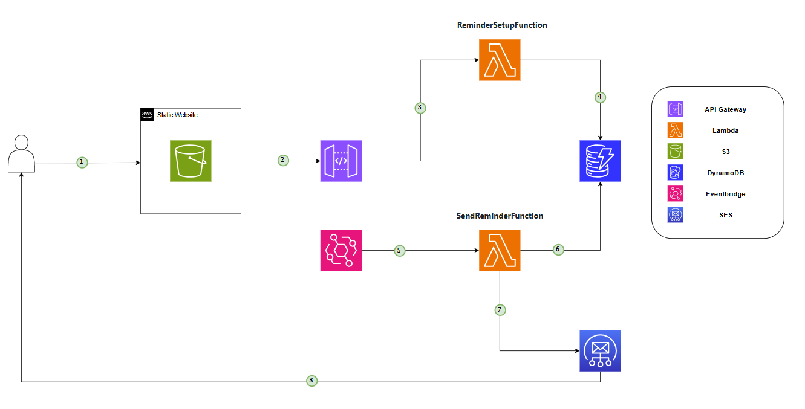
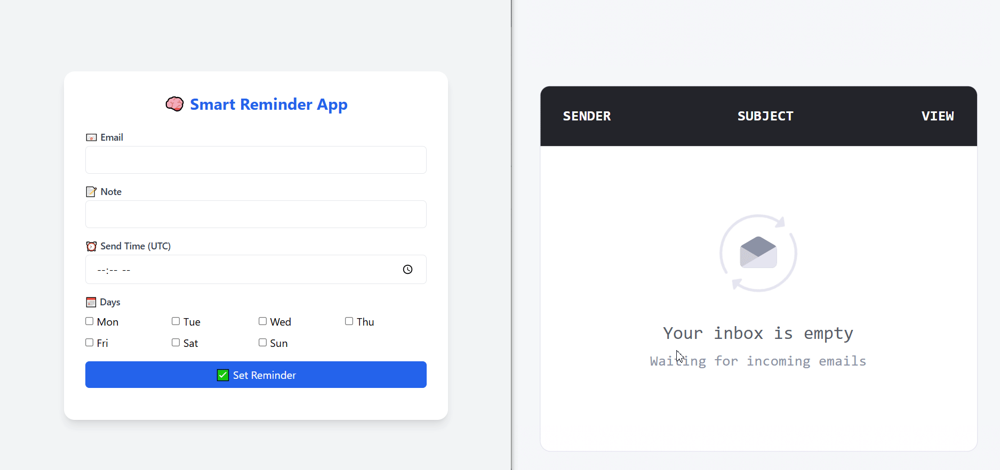
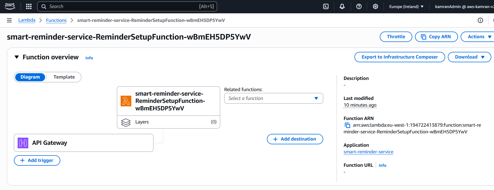
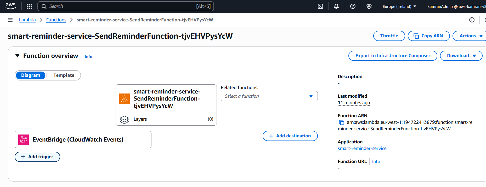
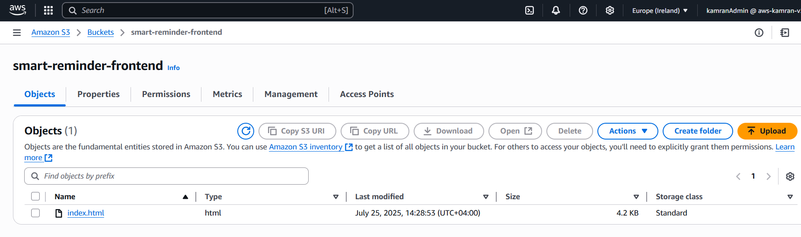

# 🧠 Smart Reminder Service

[](https://www.oracle.com/java/)
[](https://aws.amazon.com/lambda/)
[](https://aws.amazon.com/api-gateway/)
[](https://aws.amazon.com/s3/)
[](https://aws.amazon.com/dynamodb/)
[](https://aws.amazon.com/eventbridge/)
[](https://aws.amazon.com/ses/)
[](https://aws.amazon.com/serverless/sam/)

> It's easy to forget the things we want to do for ourselves, especially in the middle of a busy week.  
> This project offers a simple but powerful solution: users can schedule daily or weekly email reminders with motivational quotes to stay on track.

---

## 📚 Table of Contents

- [Tech Stack](#-tech-stack)
- [Features](#-features)
- [Architecture Diagram](#-architecture-diagram)
- [How It Works](#-how-it-works)
- [Live Demo](#-live-demo)
- [Deployment (via SAM)](#-deployment-via-sam)
- [Screenshots](#-screenshots)
- [Possible Improvements](#-possible-improvements)
- [Contact](#-contact)

---

## 📌 Tech Stack

- **Language:** Java 17
- **Build Tool:** Maven
- **Frontend:** HTML + Tailwind
- **Cloud Services:**
    - **AWS Lambda** – for serverless compute
    - **Amazon API Gateway** – REST API endpoints
    - **Amazon S3** – Static website
    - **Amazon DynamoDB** – user storage and reminder setup info
    - **Amazon SES** – sends reminder emails
    - **AWS SAM** – infrastructure as code (IaC)

---

## ✨ Features

- ✅ Set reminders by email, message, time, and day(s)
- 📧 Receive email reminders with quote of the day
- 🕗 Scheduled execution using EventBridge (cron jobs)
- 🗃️ User preferences stored securely in DynamoDB
- 🌐 Static frontend served via S3

---

## 📐 Architecture Diagram



---

## 📖 How It Works

1. User opens the S3-hosted website and enters:
    - Email address
    - Reminder message
    - Time (UTC)
    - Days of the week

2. The form sends a POST request to an API Gateway endpoint which triggers a Lambda function that saves data to DynamoDB.

3. A second Lambda is triggered daily by EventBridge at 8:00 AM UTC(you can specify the time based on your needs). It:
    - Scans DynamoDB
    - Matches users whose reminder time + day match current UTC time
    - Fetches a quote of the day
    - Sends a personalized email via SES

---

## 🧪 Live Demo



---

## 🚀 Deployment (via SAM)

> ⚙️ **Pre-requisites**:  
> Make sure you have the **AWS CLI** and **AWS SAM CLI** installed and configured locally with appropriate credentials.

```bash
# 1. Build
sam build

# 2. Deploy
sam deploy --guided

```

---
## 📖 Screenshots

### ✅ Lambda - ReminderSetupFunction


### 📦 Lambda - SendReminderFunction


### 🔔 S3 - Static Website


---

## 🧭 Possible Improvements

- Cognito login + user dashboard
- View, edit, and delete existing reminders
- Quote style selector (funny, deep, business)
- Styled unsubscribe footer and branding

---

## 📬 Contact

Built by **Kamran Zeynalov**

[](https://www.linkedin.com/in/zeynalov-kamran/)